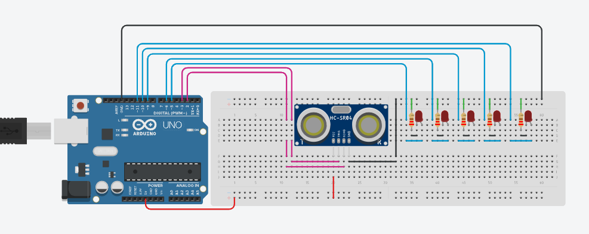

# Son-bin

## Arduino com sonar

Projeto utilizando sonar e mostrando a distancia detectada através de 5 leds que representam o número em binário, caso o valor detectado esteja fora do range pré determinado então os leds acendem e apagam da esquerda pra direita e vice versa.
Desenvolvido por Marcos, João Pedro, José Américo e Vinicius Piacini.

